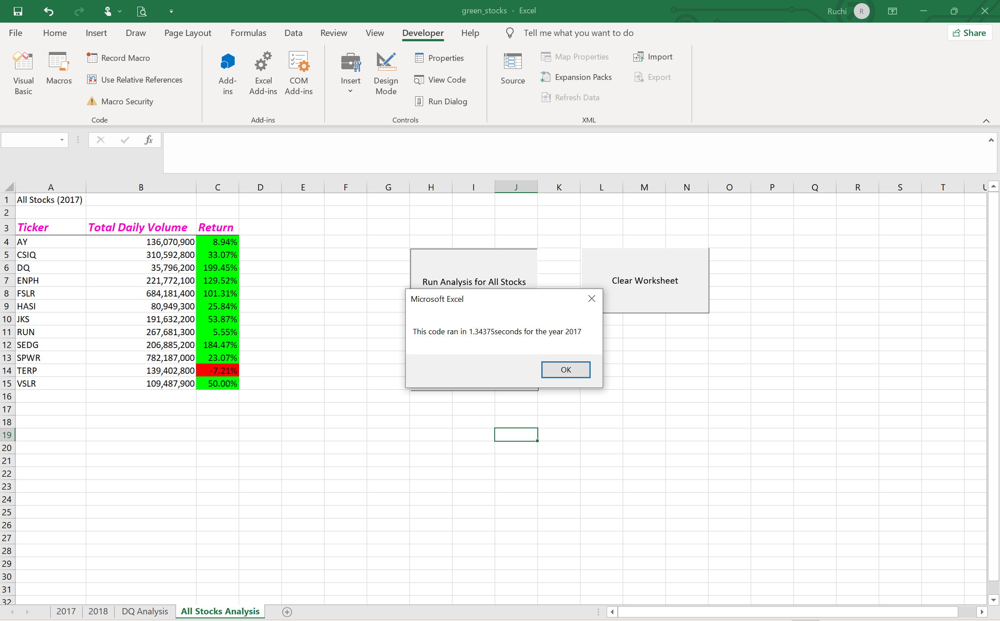
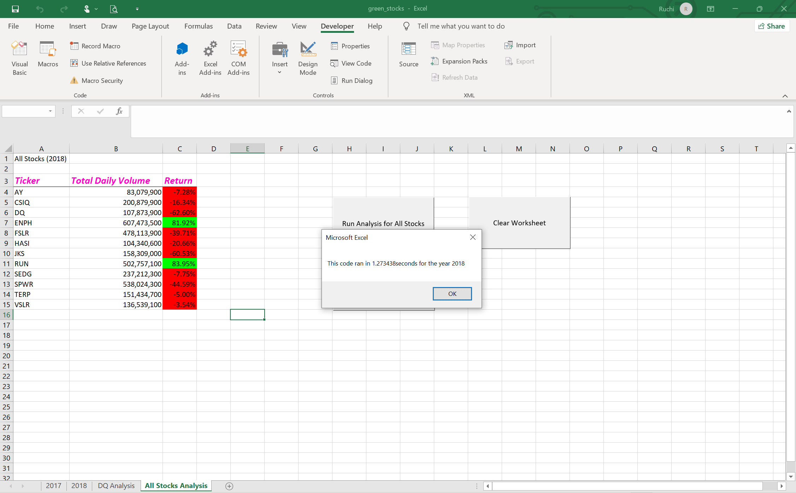
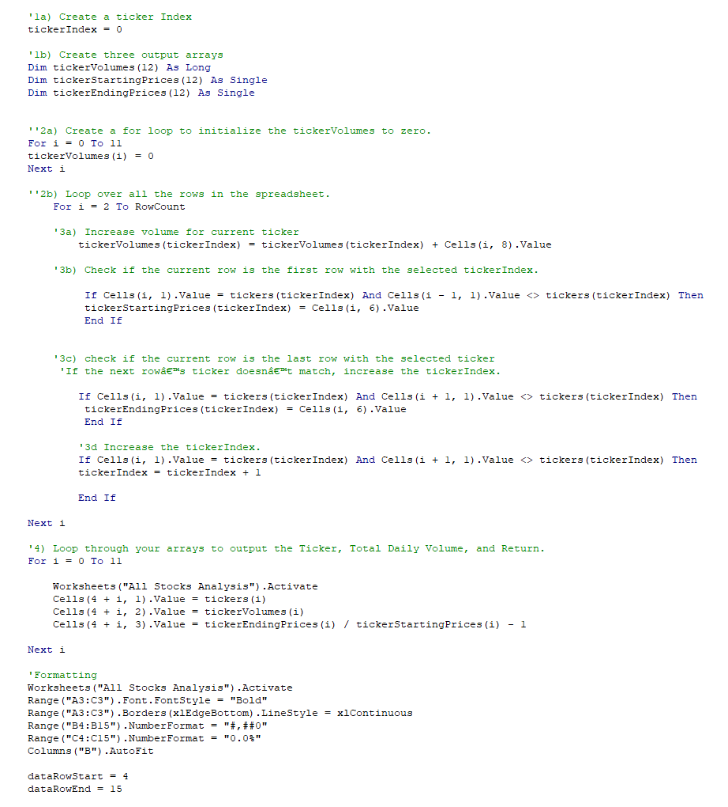
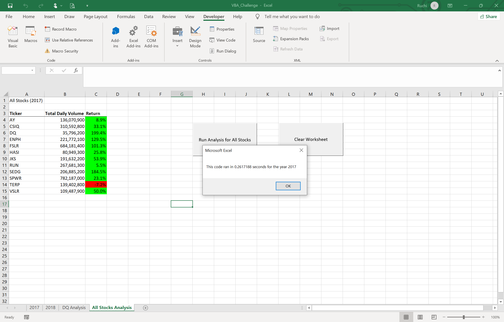
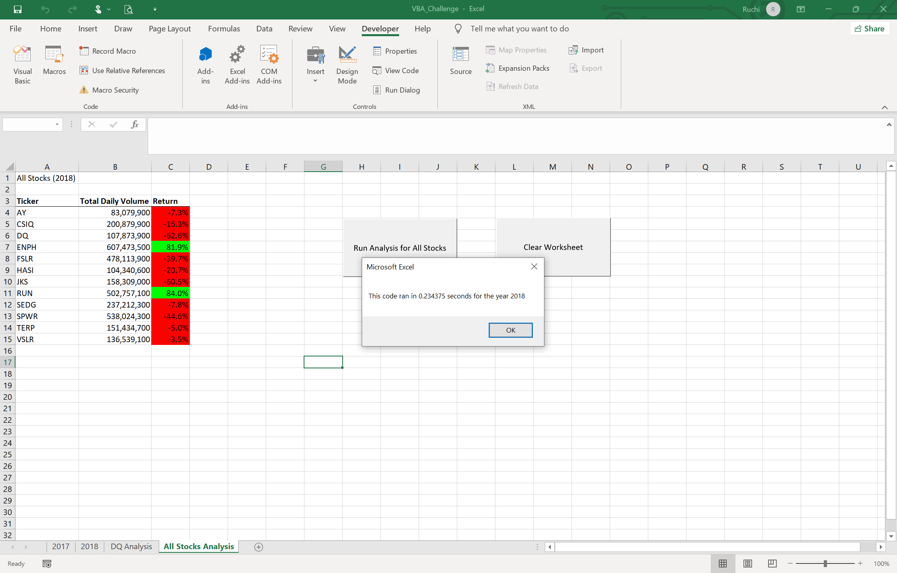

# Stock-analysis
Perform analysis of Steve's stock data to evaluate and compare stock performances.

## Overview of the Project
Steve's parents are inetersted in investing in green energy stocks and they thought DAQO looked like a great stock for investment. By using VBA we helped Steve and his parents understand that DAQO has peformed poorly recently and they should look at other green energy stocks. So we conducted an evaluation of green_stocks data tables to find the total daily volume and yearly return for each stock. Although we got the results we were looking for, however, the code run time needs to be reduced so that Steve can use the same code in the future for a larger dataset with many more stocks. Below are the images showing results from the original green_stocks code. 

#### green_stocks analysis for the year 2017

#### green_stocks analysis for the year 2018

## Refactoring code for the VBA_Challenge
In VBA Module Challenge, the task is to refactor our code so it runs faster. 
* The first step was to create a "tickerIndex" variable and setting it equal to zero before iterating over all the rows. 
* Next, three output arrays were created: "tickerVolumes", "tickerStartingPrices", and "tickerEndingPrices".
* a for loop was created to initialize the tickerVolumes to zero.
* a for loop was created to loop over all the rows in the spreadsheet.
* Inside the for loop, the current tickerVolumes variable was increased by adding the ticker volume for the current stock ticker.
* the tickerIndex variable was used as the index.
* If-Then statements were used to find first and last rows with the selected tickerIndex. First/ last rows prices were assigned to the tickerStartingPrices and tickerEndingPrices variables, respectively.
* the tickerIndex was incremented if the next row’s ticker didn't match the previous row’s ticker.
* a for loop was used to loop through arrays (tickers, tickerVolumes, tickerStartingPrices, and tickerEndingPrices) to output the “Ticker,” “Total Daily Volume,” and “Return” columns in the spreadsheet.
* The analysis was run to see the output.
#### Screenshot of the refactored code

To view the spreadsheet and VBA analysis click here [VBA_Challenge](https://github.com/rmat112/stock-analysis/blob/main/VBA_Challenge.xlsm)

## Results
After running the refactored code for 2017 and 2018 results were very clear. The images for analysis of data from each year are attached below:
#### VBA_Challenge_refactored code_for the year 2017

#### VBA_challenge_refactored code_for the year 2018

* The two tables clearly show how the stocks performed in each year. 
* In 2017, all stocks (except for one) yeilded a positive return, with 4 stocks (DQ, ENPH, FSLR, SEDG) being the top perfomrers, yeilding more than a 100% return. 
* While in 2018, only two stocks (ENPH & RUN) yeilded a positive return and DQ was the stock with highest loss @ -62%.
* As seen from images attached above, before refactoring, the 2017 analysis ran in 1.34 seconds. After refactoring, the 2017 analysis ran in 0.26 seconds.
* Before refactoring, the 2018 analysis ran in 1.27 seconds. After refactoring, the 2018 analysis ran in 0.23 seconds.
* Formatting also plays an important role in presenting the results legibly and clearly.

## Summary
Refactoring is a key part of the coding process. Following are some advantages and disadvantages of rafactoring.
### Advantages of refactoring code
With refactoring the code can be made more effecient by
* taking fewer steps
* using less memory
* improving the logic of the code
* and to make it easier for future users to read
### Disadvantages of refactoring code
* If the code is too complex, it can be difficult to refactor it.
* It is possible to make mistakes during refactoring and land on a different result accidentally.

### Refactored VBA script
A direct comparison of the analysis of green_stocks outcone and VBA_Challenge outcome shows that we got the exact same output as before, however, the refactored script ran much faster than the original script. Before refactoring the 2017 analysis ran in 1.34 seconds and 2018 analysis ran in 1.27 seconds. While, after refactoring, the 2017 analysis ran in 0.26 seconds and 2018 analysis ran in 0.23 seconds. This means that after refactoring the analysis is running more than 5 times faster. The analysis became faster due to the fact that refactored code had to loop through the dataset only once (prior to refactoring, the code had to loop through the dat 12 times).
Therefore, the script is now much more effecient and can be used effectively even when the dataset becomes very big, with hundreds of stocks not just 12.
